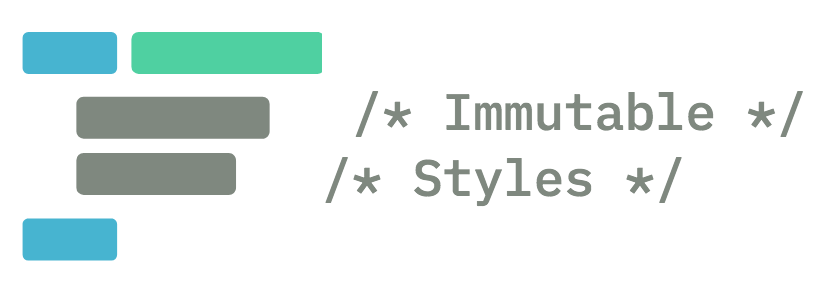
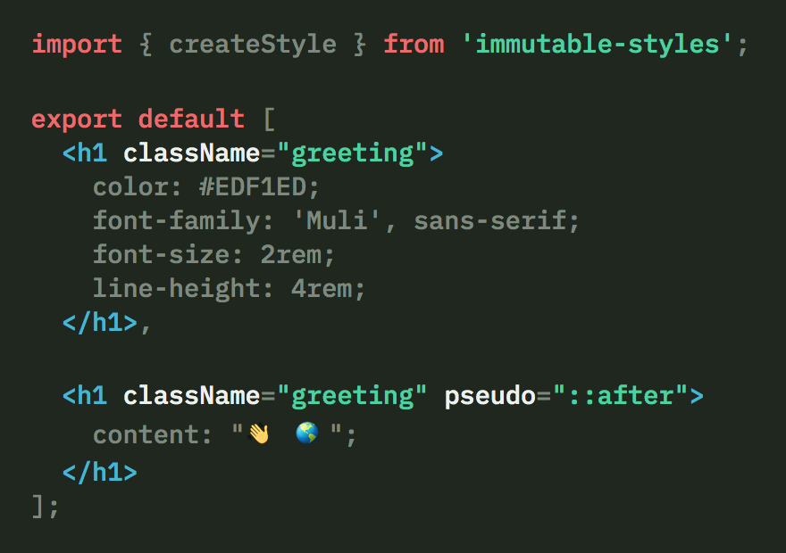
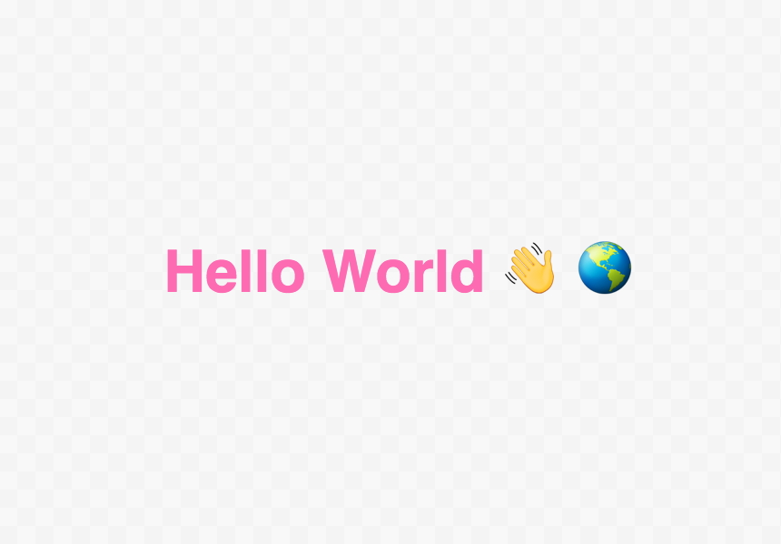
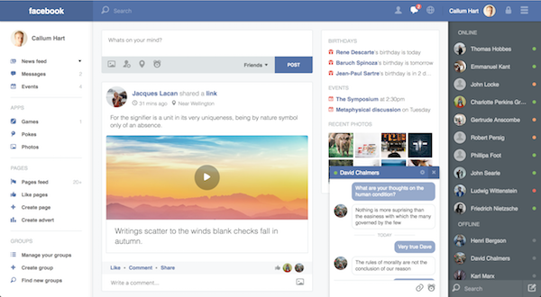
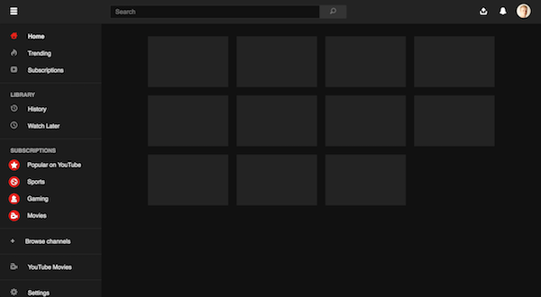

<h1 align="center"> Immutable Styles</h1>

> ###### Immutable Styles | ɪˈmjuːtəb(ə)l | stʌɪl |

> A library for styling web interfaces with a focus on predictability and robustness. It uses immutability to remove side effects often tied to CSS, allowing UI bugs to be caught ahead of time.

| Source | Result |
| :----------------- | :----- |
|  |  |

## Features

- ⚠️ Compile Time Errors
- 🚫 CSS Override Prevention
- 📱 Discrete Breakpoints
- 👪 Strict Inheritance
- 🕵🏻 Duplicate Property Detection
- ⛱️ Typed Selectors
- 🗿 Immutable Mixins
- 🏹 Explicit Selectors

## What is Immutable Styles?

Immutable styles is a cross between a CSS pre-processor and a CSS-in-JS library. Styles are written using JSX which are subsequently compiled to CSS. The library has 2 goals:

1. Make styles for the web **predictable**
2. Make styles for the web **robust**

If you have ever encountered styles that were neither expected nor desired you probably met a CSS side effect; most likely a consequence of:

- a) Selectors clashing with other selectors
- b) Selectors targeting unwanted elements
- c) Styles overriding other styles
- d) Elements inheriting undesirable styles

As the name suggests the library uses immutability to help remove these side effects. With immutable styles all CSS rules are immutable. An immutable CSS rule cannot change once created, which means it can **never** be overridden. This alone solves a, b and c (we will see the solution to d later).

## FAQ

### Why choose immutable styles over something else?

The most popular CSS strategies around today share one thing in common:

They all **reduce overrides**.

[BEM](http://getbem.com/naming/) uses naming conventions to modularise CSS, leveraging namespaces to encapsulate styles. [CSS Modules](https://github.com/css-modules/css-modules) implements local scope, where styles in one file cannot override styles in another. CSS-in-JS solutions such as [styled components](https://www.styled-components.com/) generate unique classes to avoid selectors clashing.

Despite the implementation differences each approach converges in regards to overrides; fewer overrides make CSS more robust and easier to maintain. The theory behind immutable styles is: if fewer overrides are better, why override at all?

### Can I use immutable styles with React/AngularJS/Vue/Backbone/Elm/Clojure...?

Immutable styles is markup agnostic, which means it isn’t coupled or biased to a specific way of generating HTML. Just like a CSS pre-processor immutable styles spits out CSS which can be used on any website, rendered server or client-side.

### Have any websites been built without CSS overrides?

Yes. Immutable styles evolved from an earlier open-source project of mine called [mono](https://callum-hart.gitbooks.io/mono/). As part of monos R&D I built three websites without using any CSS overrides:

| Facebook | YouTube | YouTube (Dark) |
| --- | --- | --- |
|  |  |  |

### Can I Contribute?

Absolutely. This project is very welcome to feedback, fresh perspectives, feature requests, pull requests, and of course contributors ✌️

## Documentation

The documentation can be [found here](https://callum-hart.gitbook.io/immutable-styles/).

## Shoutouts

Shoutout to [Joseph Luck](https://github.com/josephluck) and the good guys at [Goodlord](https://github.com/ohgoodlord) for the invaluable feedback on the early prototype 🙌

## Licence

[MIT](https://github.com/callum-hart/immutable-styles/blob/master/LICENSE)
