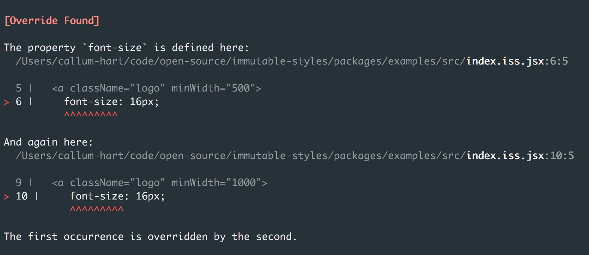

# Discrete Breakpoints

Discrete breakpoints are a design pattern that ensure styles in one media query do not override styles in another media query. This means two or more media queries *cannot overlap* if they contain rulesets that override each other. The rationale behind this is best illustrated using breakpoints that *do overlap* in regular CSS:

```css
@media (min-width: 500px) {
  a.logo {
    font-size: 16px;
  }
}

@media (min-width: 1000px) {
  a.logo {
    font-size: 18px;
  }
}
```

In the example above the media queries rely on their position in the cascade to produce the expected behaviour, with the last in the cascade taking effect. On screens wider than 1000px the bottom ruleset overrides the other, so the `font-size` of `a.logo` will be 18px.

Reshuffling the order of the rulesets produces a different outcome:

```css
@media (min-width: 1000px) {
  a.logo {
    font-size: 18px;
  }
}

@media (min-width: 500px) {
  a.logo {
    font-size: 16px;
  }
}
```

Once again the last ruleset in the cascade takes effect. On screens wider than 1000px the `font-size` of `a.logo` will be 16px. Unintuitively it is the **cascade and not the breakpoint size** that determines the `font-size` of the logo.

Discrete breakpoints remove this dependency media queries have on the cascade. In immutable styles the compiler identifies any media queries that overlap, and then checks if they contain any overriding rulesets.

The equivalent immutable ruleset for the logo would be:

```jsx
<a className="logo" minWidth="500">
  font-size: 16px;
</a>,

<a className="logo" minWidth="1000">
  font-size: 16px;
</a>
```

However this throws a compile time error, since on screens wider than 1000px the logos `font-size` is defined twice:

<p align="center">
  
</p>

The solution is to partition the media queries into discrete breakpoints (media queries that do not overlap) by adding a `maxWidth` of 999px to the first ruleset:

```jsx
<a className="logo" minWidth="500" maxWidth="999">
  font-size: 16px;
</a>,

<a className="logo" minWidth="1000">
  font-size: 16px;
</a>
```

Since the media queries no longer overlap switching the order of rulesets no longer changes their outcome:

```jsx
<a className="logo" minWidth="1000">
  font-size: 16px;
</a>,

<a className="logo" minWidth="500" maxWidth="999">
  font-size: 16px;
</a>
```

<p align="center">*</p>

It is also worth noting that in regular CSS media queries are also dependant on specificity:

```css
nav a.logo {
  font-size: 14px;
}

@media (min-width: 500px) {
  a.logo {
    font-size: 16px;
  }
}
```

In the example above the ruleset with the strongest specificity out-competes the other, regardless of position in the cascade or breakpoint size. On screens wider than 500px the `font-size` of `a.logo` will be 14px, since the `nav a.logo` selector has the higher specificity.

The equivalent immutable ruleset would be:

```jsx
<nav>
  <a className="logo">
    font-size: 14px;
  </a>
</nav>,

<a className="logo" minWidth="500">
  font-size: 16px;
</a>
```

However this throws a compile time error, since on screens wider than 500px the first ruleset overrides the second ruleset.

<p align="center">*</p>

Discrete breakpoints makes media queries more predictable since there’s no need to orchestrate overrides. Omitting overrides has made the order of media queries and their specificity irrelevant. Only the breakpoint size determines what styles apply which is far more intuitive and deterministic.

This pattern buys guarantees. We can guarantee what font size the logo will be on different screen-sizes. We can guarantee that changing the order of media queries won’t affect the outcome, and changing specificity won’t sidestep the cascade and override subsequent rulesets. Finally, we can guarantee the font size in one media query won’t get overridden by another.