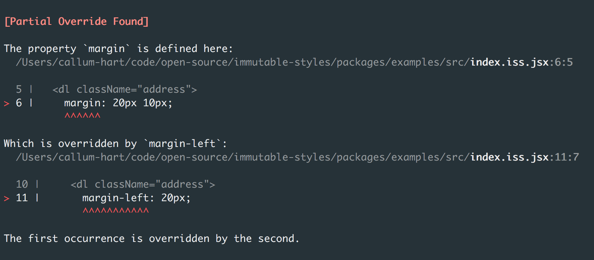
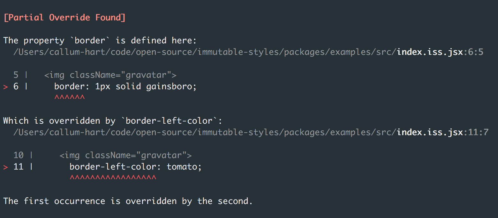
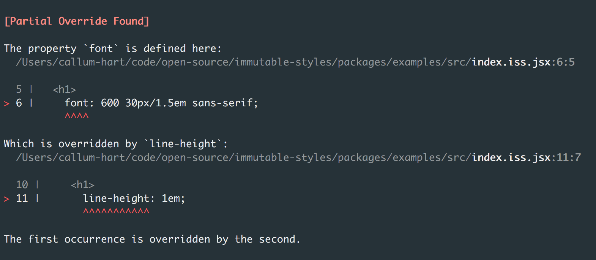

# Partial Overrides

A partial override occurs when two or more rulesets containing related, but not *identical* declarations target the same element. This happens when a shorthand property overrides a longhand property – or visa versa. Here is a partial override in its simplest form:

```jsx
<dl className="address">
  margin: 20px 10px;
</dl>,

<footer>
  <dl className="address">
    margin-left: 20px;
  </dl>
</footer>
```

In the example above the first ruleset uses the shorthand property `margin`, which translated to computed styles equates to:

- `margin-top: 20px;`
- `margin-right: 10px;`
- `margin-bottom: 20px;`
- `margin-left: 10px;`

The second ruleset attempts to override the left margin using the longhand property `margin-left`. However since the left margin already has a value (of 10px) it cannot be overriden. Immutable styles detects this partial override and throws the following compile time error:

<p align="center">
  
</p>

Another example of partial overrides can be seen when both shorthand and longhand border properties target the same element:

```jsx

  border: 1px solid gainsboro;
</img>,

<div className="feed">
  
    border-left-color: tomato;
  </img>
</div>
```

The first ruleset uses the shorthand property `border`, which translated to computed styles equates to:

- `border-top-width: 1px;`
- `border-top-style: solid;`
- `border-top-color: gainsboro;`
- `border-right-width: 1px;`
- `border-right-style: solid;`
- `border-right-color: gainsboro;`
- `border-bottom-width: 1px;`
- `border-bottom-style: solid;`
- `border-bottom-color: gainsboro;`
- `border-left-width: 1px;`
- `border-left-style: solid;`
- `border-left-color: gainsboro;`

The second ruleset attempts to override the left border color using the longhand property `border-left-color`, which again is caught by the compiler:

<p align="center">
  
</p>

Not all partial overrides are so easy to detect:

```jsx
<h1>
  font: 600 30px/1.5em sans-serif;
</h1>,

<nav>
  <h1>
    line-height: 1em;
  </h1>
</nav>
```

The first ruleset uses the shorthand property `font`, which translated to computed styles equates to:

- `font-weight: 600;`
- `font-size: 30px;`
- `line-height: 1.5em;`
- `font-family: sans-serif;`

Fortunately immutable styles is aware that the `line-height` set by `font` in the first ruleset is overridden by the second ruleset:

<p align="center">
  
</p>
