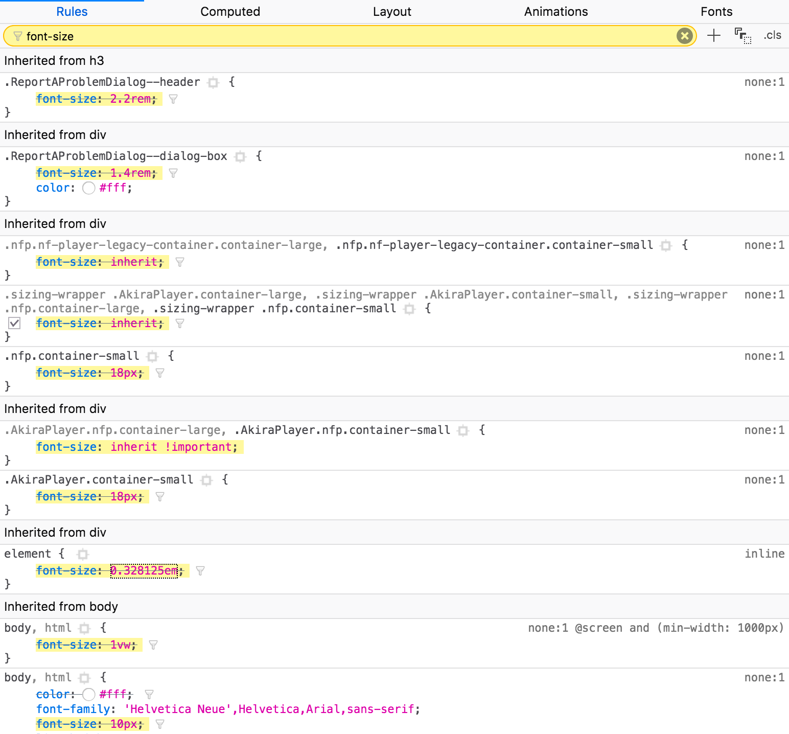
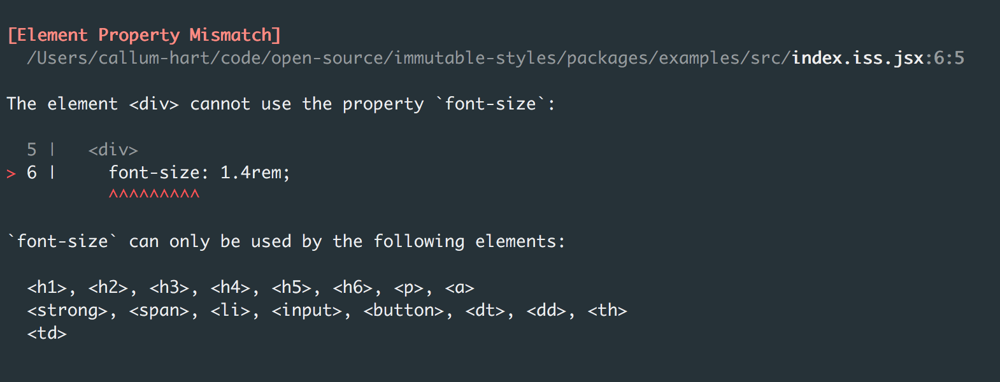

# Strict Inheritance

Strict inheritance prevents inheritable CSS properties from being inherited. At first glance this may seem like an odd feature, however the current CSS inheritance model can quickly get out-of-hand, and thus become unpredictable. An example taken from one of the top 30 most visited sites on [Alexa](https://www.alexa.com/topsites) can be seen below:

<p align="center">
  
</p>

In the screenshot above the `font-size` of the target element is defined 10 times. Having 10 `font-size` declarations is either the result of 10 instances where the developer(s) intent was to override the font-size, or more likely is the result of poorly scoped selectors. Either way the `font-size` of the target element is extremely brittle.

Inheritable properties are very vulnerable to changes in HTML attributes/structure, selector specificity or cascade position. A single change can produce a different outcome. In this case `!important` has been used to protect the `font-size` from changes to specificity or cascade. However the winning property value is `inherit` which means a further step is needed to track down where the `font-size` is inherited from.

Strict inheritance avoids situations like this. With strict inheritance, each inheritable property can only be used by a set of whitelisted elements. For example setting `font-size` on a `div` is not allowed:

```jsx
<div>
  font-size: 1.4rem;
</div>
```

Attempting to do so throws a compile time error:

<p align="center">
  
</p>

With strict inheritance applying `font-size` to a `div` is too vague. Instead `font-size` should be applied to a textual element:

```jsx
<div>
  <p>
    font-size: 1.4rem;
  </p>
</div>
```

This makes the behaviour of inheritable properties far more deterministic. In the example above the `font-size` of the `p` is and always will be 1.4rem. The risk of the `p` inheriting a font size from somewhere else is removed. Treating inheritable properties like non-inheritable properties makes their behaviour predictable and robust.
