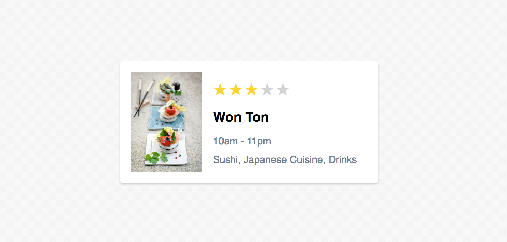
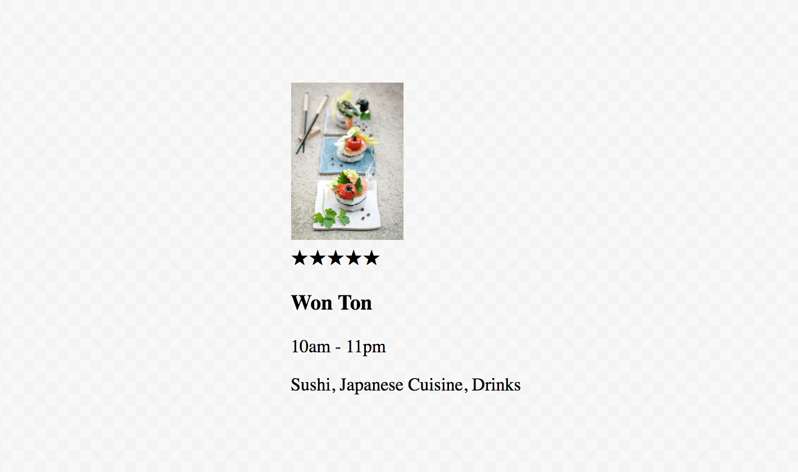
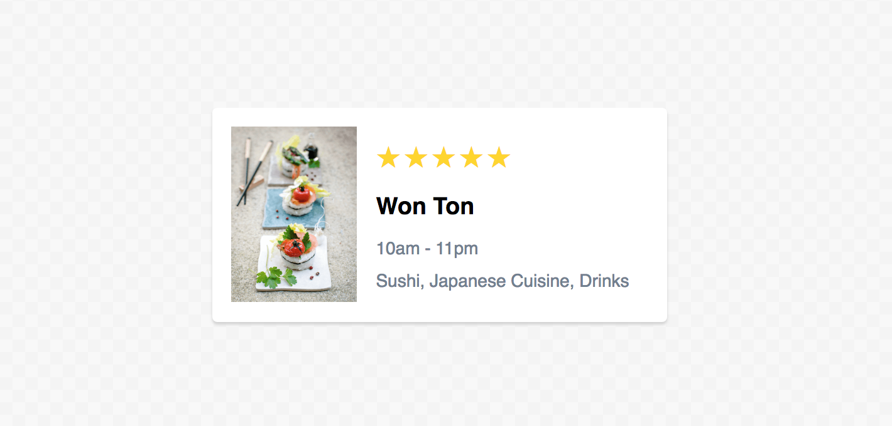
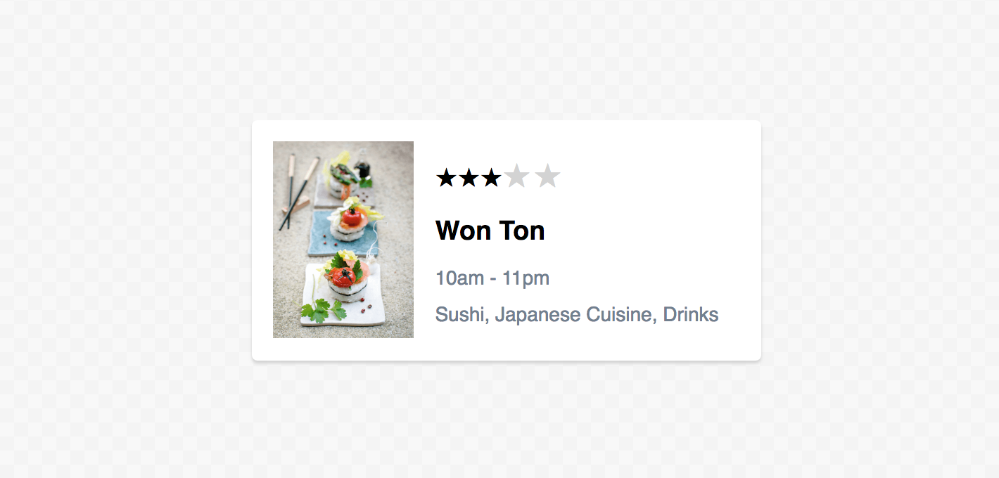

# Beginner Tutorial

The goal of this tutorial is to introduce immutable styles in a *hopefully* accessible way.

This tutorial will use a fictitious food app to demonstrate how immutable styles is used for styling web interfaces. For the sake of berevity we will focus on styling a single part of the app – the restaurant card, which displays information for a given restaurant:

<p align="center">
  
</p>

Although fairly trivial, the restaurant card provides the perfect fit for illustrating the basic concepts of immutable styles without getting distracted by unnecessary and excessive details.

## Setup

The first step is to clone the [immutable styles ]() repository:

```
git clone git@github.com:callum-hart/immutable-styles.git
```

Then navigate to the `tutorial` directory and install its dependencies:

```
cd immutable-styles/packages/tutorial
npm install
```

And then start the application:

```
npm run start
```

Finally open [localhost:8080](http://localhost:8080) in your favourite browser.

In its current state the restaurant card looks rather unappetising since its markup is unstyled:

<p align="center">
  
</p>

The files we are interested in are: src/RestaurantCard.jsx – which contains the restaurant cards markup and: src/RestaurantCard.**iss.jsx** – which *will* contain the restaurant cards styles.

You may have noticed `RestaurantCard.iss.jsx` uses a dual file extension of `.iss.jsx`. The first part – `iss` stands for Immutable Style Sheets (or ISS for short). This naming convension allows the compiler to efficiently identify Immutable Style Sheets – whilst preserving JSX syntax highlighting.

> ###### Note on Markup

> Although this tutorial uses React, it should be noted that immutable styles is markup agnostic – meaning it isn’t coupled or biased to a specific way of generating HTML. Just like a CSS pre-processor – immutable styles generates CSS which can be used on any website – rendered server or client-side.

## Boilerplate

`RestaurantCard.iss.jsx` currently contains boilerplate code typical of any Immutable Style Sheet:

```jsx
1|  /** @jsx createStyle */
2|  import { createStyle } from 'immutable-styles';
3|
4|  export default [];
```

Line 2 imports `createStyle` from immutable styles – which is a function that generates immutable rulesets. On line 1 the `createStyle` function is mapped to JSX – meaning any JSX tags in this file will be transpiled to `createStyle` function calls. Line 4 *will* export our immutable rulesets.

## Styling the Restaurant Card

Lets create our first immutable ruleset. Since it's our first lets make it special ⭐️. We will style the restaurants star rating icons.

Replace line 4 of  `RestaurantCard.iss.jsx` with the following snippet:

```jsx
export default [
  <div className="stars">
    margin-bottom: 10px;

    <span>
      margin-right: 2px;
      font-size: 20px;
      color: gold;
    </span>
  </div>
];
```

Save the file – and you should see the following:

<p align="center">
  
</p>

Next, lets focus on the layout of the restaurant card. The details – the restaurants: rating, name, opening time and summary – should sit to the right of the image. Add the following to `RestaurantCard.iss.jsx`:

```jsx
export default [
  <section className="card">
    display: flex;
  </section>,

  <div className="details">
    flex: 1;
    margin: 10px 15px 0;
  </div>,

  <div className="stars">
    {/* ... */}
  </div>
];
```

With the ruleset for the restaurant card in place lets improve on its appearance. Replace lines 5 to 7 with the following snippet:

```jsx
<section className="card">
  display: flex;
  padding: 15px;
  border-radius: 4px;
  background: white;
  box-shadow: 0 2px 2px 0 lightgrey;
</section>,
```

And finally, lets spruce up the typography:

```jsx
<h3>
  margin: 15px 0;
  font-family: sans-serif;
</h3>,

<p>
  margin: 10px 0;
  font-family: sans-serif;
  font-size: 14px;
  color: slategrey;
</p>
```

Save the file, and you should see the following:

<p align="center">
  
</p>

So far, all restaurants in our app will have a five star rating. Sadly, in the real world this isn't always the case – some restaurants get a three star rating. Lets update both the markup and styling accordingly.

Firstly, change the default star color from `gold` to `lightgrey`:

```jsx
<div className="stars">
  {/* ... */}

  <span>
    {/* ... */}
    color: lightgrey;
  </span>
</div>
```

Now, in `RestaurantCard.jsx` add the classname "shining" to the top three stars:

```jsx
10| <div className="stars">
11|   <span className="shining">★</span>
12|   <span className="shining">★</span>
13|   <span className="shining">★</span>
14|   <span>★</span>
15|   <span>★</span>
16| </div>
```

If you save the file – you will notice the first three stars are unstyled:

<p align="center">
  
</p>

This is to be expeceted. Immutable styles treat type selectors – in this case `<span>` – and selectors with a class – in this case `<span className="shining">` as different selectors – *even though* they target the same element type. The type selector `<span>` only targets elements of type `span` that do not have a class. Elements of type `span` with a class – such as "shining" need to be styled individually. This is a *key difference* between immutable styles and CSS – and is one of the traits that make immutable styles highly deterministic.

> ###### Key Point

> Styles for an element without a class (such as `span`) **are not applied** to the same element type with a class (such as `<span className="shining">`).

With that in mind, add a ruleset for stars with the class "shining":

```jsx
<div className="stars">
  {/* ... */}

  <span>
    {/* ... */}
  </span>

  <span className="shining">
    margin-right: 2px;
    font-size: 20px;
    color: gold;
  </span>
</div>
```

> ###### Note on Sharing Styles

> You may have noticed 2/3rds of the CSS declarations for `<span>` and `<span className="shining">` are the same (each ruleset contains both `margin-right` and `font-size`). Immutable styles provides ways to remove duplicate styles, aiding reuse among similar rulesets – however in the interests of not overcomplicating this tutorial won't be introduced yet.

## Interactions & Responsiveness

The restaurant card is looking pretty good so far, however it's currently a bit static. It would be nice to add a hover effect and make sure the layout is optimized for mobile devices.

Firstly lets add the hover effect, which is achieved using the **`pseudo`** JSX attribute (previously introduced in ["The Basics"]() guide):

```jsx
<section className="card">
  {/* ... */}
  transition: background .15s ease-in-out, transform .15s ease-in-out;
</section>,

<section className="card" pseudo=":hover">
  background: ivory;
  transform: scale(1.05);
  cursor: pointer;
</section>,
```

Now, lets optimize the restaurant card for mobile using the **`maxWidth`** JSX attribute:

```jsx
<section className="card">
  {/* ... */}
</section>,

<section className="card" pseudo=":hover">
  {/* ... */}
</section>,

<section className="card" maxWidth="600">
  margin: 0 20px;

  
    display: none;
  </img>
</section>,
```

And finally lets tighten up the spacing, to allow more content to fit on smaller screen-sizes:

```jsx
<section className="card" maxWidth="600">
  {/* ... */}
  padding: 0px;

  
    {/* ... */}
  </img>
</section>,
```

If you save the file and open up the browsers console you will see an error has be thrown: ```[Override Found] The property `padding` has already been defined``` – and the newly added styles have not been applied. Navigate to your terminal window and you will see the following compile time error:

<p align="center">
  
</p>

As the error message shows the `padding` has been defined twice. The `padding` set in the first occurance (line 7) is applied to the card on *all* screen-sizes. The `padding` set in the second occurance (line 22) is applied to the card on screens up to 600px wide. This means on screen widths between 0px and 600px the `padding` property is applied twice – which *would* result in an override, if it weren't for the compiler catching it.

> ###### Key Point

> The immutable styles compiler can detect and prevent overrides that only occur on specific screen-sizes.

With this in mind, the first `padding` declaration (line 7) should be moved out to another ruleset that specifically targets screens wider than 600px:

```jsx
<section className="card">
  {/* ... */}
</section>,

<section className="card" pseudo=":hover">
  {/* ... */}
</section>,

<section className="card" maxWidth="600">
  {/* ... */}

  
    {/* ... */}
  </img>
</section>,

<section className="card" minWidth="601">
  padding: 15px;
</section>,
```

If you save the file and navigate to your terminal window the compile time error should be resolved, and the latest styles should be visible in your browser.
