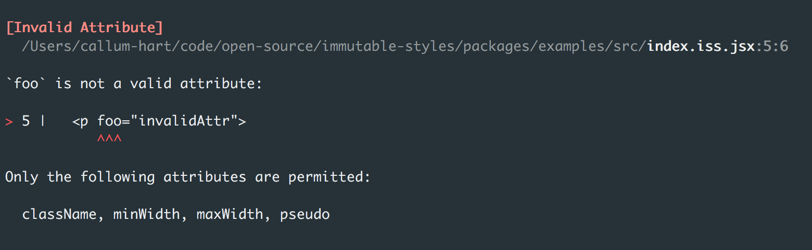
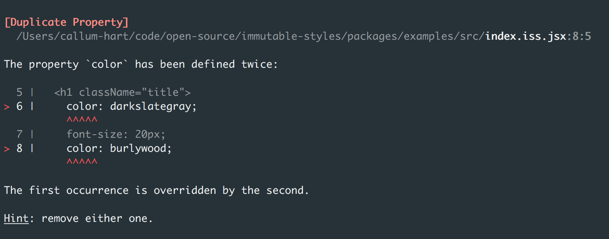
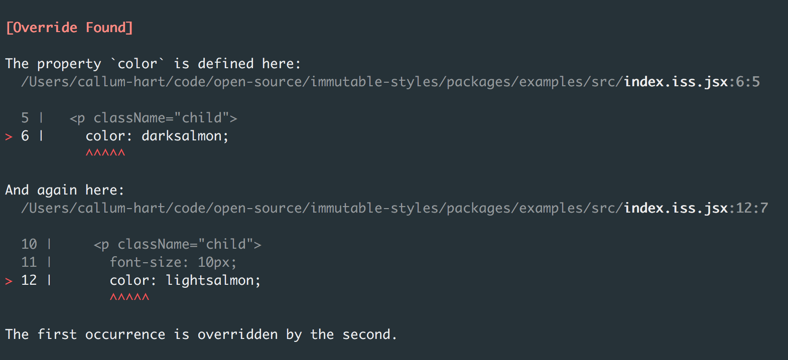
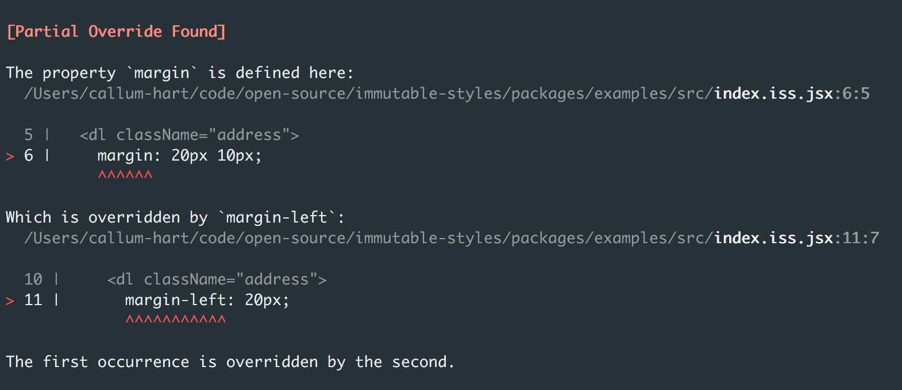
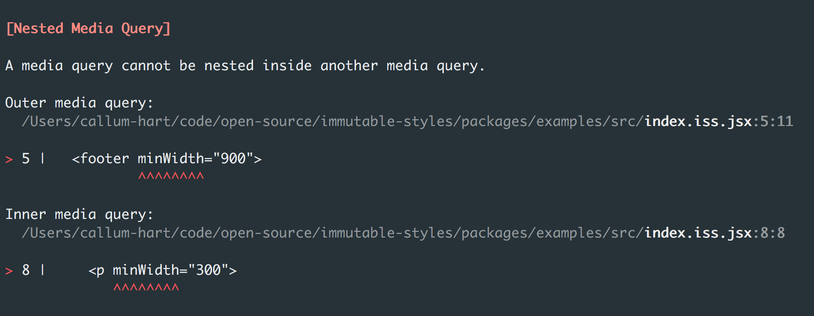
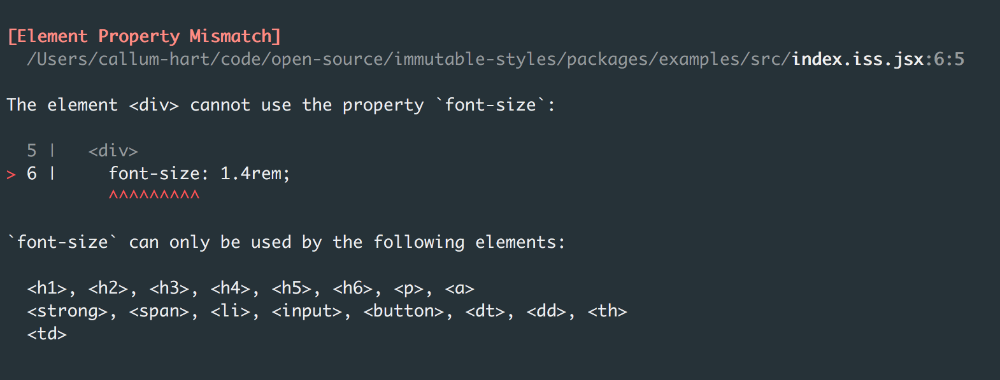

## Compile Time Errors

Immutable styles ships with a friendly compiler that helps assist development, rather than bark at you. If the compiler finds an error, such as a CSS override the compilation process is terminated and an error is thrown.

Each error is documented below including the problem code and the error thrown.

### Unknown Attribute

When an unknown attribute is found:

```jsx
<p foo="invalidAttr">
  font-size: 20px;
</p>
```

Throws:

<p align="center">
  
</p>

### Duplicate CSS Property

When a CSS property is defined more than once in same block.

```jsx
<h1 className="title">
  color: darkslategray;
  font-size: 20px;
  color: burlywood;
</h1>
```

Throws:

<p align="center">
  
</p>

### Exact Override Found

When one style overrides another style.

```jsx
<p className="child">
  color: darksalmon;
</p>,

<div className="parent">
  <p className="child">
    font-size: 10px;
    color: lightsalmon;
  </p>
</div>
```

Throws:

<p align="center">
  
</p>

### Partial Override Found

When one style partially overrides another style.

```jsx
<dl className="address">
  margin: 20px 10px;
</dl>,

<footer>
  <dl className="address">
    margin-left: 20px;
  </dl>
</footer>
```

Throws:

<p align="center">
  
</p>

### Nested Media Query

When a media query is nested inside another media query.

```jsx
<footer minWidth="900">
  padding: 0 30px;

  <p minWidth="300">
    font-size: 1rem;
  </p>
</footer>
```

Throws:

<p align="center">
  
</p>

### Element Property Mismatch

When an inheritable property is used by an invalid element type:

```jsx
<div>
  font-size: 1.4rem;
</div>
```

*See [Strict Inheritance]() for more details.*

Throws:

<p align="center">
  
</p>
