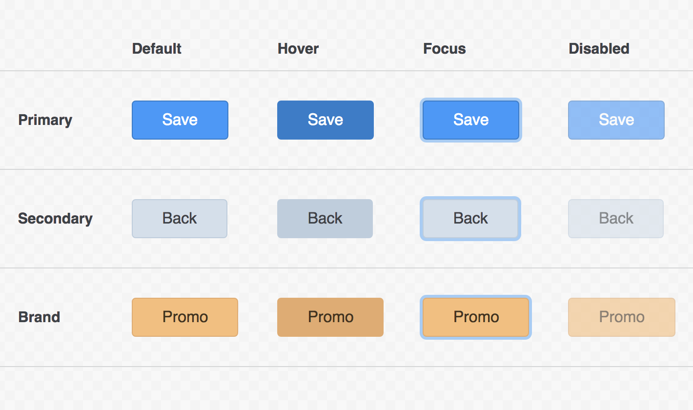

# Sharing Styles

Immutable styles provides a couple of ways to share common styles among similar rulesets:

1. [Mixins]()
2. [Detached Rulesets]()

Mixins are used to share styles among rulesets with the *same* element type. Whilst detached rulesets are used to share styles among rulesets with *different* element types.

This guide will feature an example for each approach.

### Sharing Styles with Mixins

For mixins we will extend the button example first introduced in ["The Basics"]() guide.

The designer has returned to the styleguide and added a few different button variations. Additionally each variation now has four UI states: a default, hover, focussed, and disabled state.

Here is our fictitious styleguide:

<p align="center">
  
</p>

From the styleguide above we can identify common styles shared among all buttons:

- `padding`
- `border-width`
- `border-style`
- `border-radius`
- `font-size`
- `font-family`
- `cursor`

In contrast we can also identify styles unique to each button type:

- `background`
- `border-color`
- `color`

The common styles for the default state can be put into a mixin:

```jsx
/** @jsx createStyle */
import { createStyle, createMixin } from 'immutable-styles';

const button = {
  default: createMixin(
    <button>
      padding: 10px 30px;
      border-width: 1px;
      border-style: solid;
      border-radius: 4px;
      font-size: 1rem;
      font-family: 'Open Sans', sans-serif;
      cursor: pointer;
    </button>
  )
};
```

Each button variation can use the `button.default` mixin to apply the common styles shared among all butons, and then apply its own styles unique to the button type:

```jsx
/** @jsx createStyle */
import { createStyle, createMixin } from 'immutable-styles';

const button = {
  /* ... */
};

export default [
  <button.default className="btn-primary">
    background: #4A96F8;
    border-color: #3B7AC9;
    color: #FFFFFF;
  </button.default>,

  <button.default className="btn-secondary">
    background: #D5DFEB;
    border-color: #BFCDDD;
    color: #3D4247;
  </button.default>,

  <button.default className="btn-brand">
    background: #F2C07C;
    border-color: #DFAD70;
    color: #44321B;
  </button.default>
];
```

The same approach can be applied to the different UI states. Common styles for each state can be assigned to its own mixin:

```jsx
/** @jsx createStyle */
import { createStyle, createMixin } from 'immutable-styles';

const button = {
  default: createMixin(
    /* ... */
  ),
  hover: createStyle(
    <button pseudo=":hover">
      cursor: pointer;
    </button>
  ),
  focus: createMixin(
    <button pseudo=":focus">
      outline: none;
      box-shadow: 0 0 0 3px #A8CBF5;
    </button>
  ),
  disabled: createMixin(
    <button pseudo=":disabled">
      opacity: 0.6;
      pointer-events: none;
    </button>
  )
};

export default [
  // Primary Button

  <button.default className="btn-primary">
    {/* ... */}
  </button.default>,
  <button.hover className="btn-primary">
    background: #3B7AC9;
  </button.hover>,
  <button.focus className="btn-primary" />,
  <button.disabled className="btn-primary" />,

  // Secondary Button

  <button.default className="btn-secondary">
    {/* ... */}
  </button.default>,
  <button.hover className="btn-secondary">
    background: #BFCDDD;
  </button.hover>,
  <button.focus className="btn-secondary" />,
  <button.disabled className="btn-secondary" />,

  // Brand Button

  <button.default className="btn-brand">
    {/* ... */}
  </button.default>,
  <button.hover className="btn-brand">
    background: #DFAD70;
  </button.hover>,
  <button.focus className="btn-brand" />,
  <button.disabled className="btn-brand" />
];
```

### Sharing Styles with Detached Rulesets

Detached rulesets allow groups of styles to be shared accross different rulesets. For example:

```jsx
/** @jsx createStyle */
import { createStyle } from 'immutable-styles';

const fontSmall = `
  font-family: 'Open Sans', sans-serif;
  font-size: 0.75rem;
  line-height: 1.5rem;
`;

const fontMedium = `
  font-family: 'Open Sans', sans-serif;
  font-size: 1rem;
  line-height: 2rem;
`;

const fontLarge = `
  font-family: 'Open Sans', sans-serif;
  font-size: 1.5rem;
  line-height: 3rem;
`;

const fontExtraLarge = `
  font-family: 'Open Sans', sans-serif;
  font-size: 2rem;
  line-height: 4rem;
`;

// usage:

export default [
  <h1>
    { fontExtraLarge }
  </h1>,
  <h2>
    { fontLarge }
  </h2>,
  <h3>
    { fontMedium }
  </h3>,
  <th>
    { fontMedium }
  </th>,
  <td>
    { fontSmall }
  </td>,
  <p>
    { fontSmall }
  </p>,
  <strong>
    { fontSmall }
  </strong>
];
```
