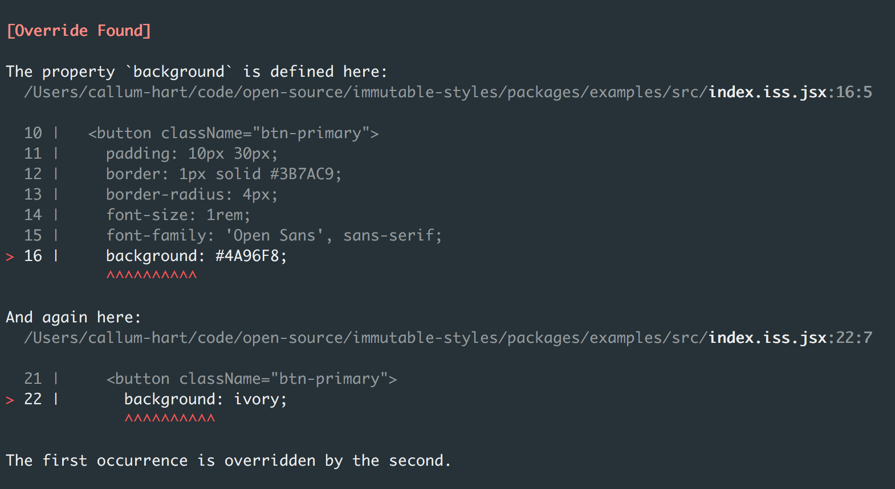

# The Basics

## Written using JSX

### Data Structure

Immutable Styles are represented using a [Tree](https://en.wikipedia.org/wiki/Tree_(data_structure)) – the same data structure as HTML – and are written using JSX (like React). Here is an immutable style in its simplest form:

```jsx
<h1>
  font-family: "Operator Mono";
  font-weight: 600;
  font-size: 2rem;
</h1>
```

The example above is the equivalant of a CSS ruleset. It consists of a *selector* – in this case the `h1` tag, and contains three CSS declarations: `font-family`, `font-weight` and `font-size`. In immutable styles this is known as an **immutable ruleset**.

An immutable ruleset can contain other immutable rulesets:

```jsx
<dl>
  <dt>
    flex-basis: 50%;
  </dt>
</dl>
```

The example above equates to a CSS ruleset that consists of two selectors. The `flex-basis` declaration will apply to elements matching the second selector – the `dt` tag *only* when the ancestor element matches the first selector – the `dl` tag. This is the equivalant of a CSS *decendant selector*.

An immutable ruleset can contain *both* CSS declarations and other immutable rulesets:

```jsx
<dl>
  display: flex;
  flex-wrap: wrap;
  <dt>
    flex-basis: 50%;
  </dt>
</dl>
```

The example above includes CSS declarations for both the first selector – the `dl` tag – and the second selector – the `dt` tag. As with CSS there is no limit to the number of decendants in a given selector. In the example above the second ruleset could contain a thrid ruleset, which in turn could contain a forth ruleset, and so on:

```jsx
<dl>
  display: flex;
  flex-wrap: wrap;
  <dt>
    flex-basis: 50%;
    <span>
      text-transform: uppercase;
    </span>
  </dt>
</dl>
```

### JSX Attributes

So far we've only seen *type selectors* – selectors that match elements by their HTML tag name. However it is common for CSS selectors to match elements based on a specific class name, pseudo class/element, and or screen-size.

In immutable styles these are achieved using JSX attributtes. Similar to props in React – immutable attributtes are defined on the opening JSX tag.

**`className`**

```jsx
<div className="side-bar">
  height: 100%;
  overflow auto;
</div>
```

The example above is the equivalant of a CSS ruleset whose *selector* matches HTML elements of type `div` *and* have the class `side-bar`.

**`pseudo`**

```jsx
<a pseudo=":hover">
  color: darkblue;
</a>
```

The example above is the equivalant of a CSS selector using the *pseudo-class* keyword that matches HTML elements of type `a` in a specific state – in this case `hover`.

Likewise the `pseudo` attribute is also used for *pseudo-elements* :

```jsx
<span pseudo="::before">
  content: "🐹";
</span>
```

> 💡Note: the `pseudo` JSX attribute supports both CSS2 (`:before`) and CSS3 (`::before`) syntax.

**`minWidth`**

```jsx
<body minWidth="900">
  font-size: 1rem;
</body>
```

The example above is the equivalant of a CSS ruleset defined within a `media-query`. In this case the selector targets the HTML element `body` on screen-sizes wider than 900px.

**`maxWidth`**

```jsx
<body maxWidth="350">
  font-size: 1.4rem;
</body>
```

The example above is the equivalant of a CSS *media-query* targeting screens less than 350px wide.

> 💡Note: the unit for media-queries is predefined by immutable styles – all media queries default to pixels – where `maxWidth="350"` equates to 350px.

> 🔮 Supporting units other than pixels is something that could be added in future.

<p align="center">*</p>

Any combination of JSX attributes can be used together:

```jsx
<div className="side-bar" minWidth="350">
  background: ivory;
  <span className="icon">
    color: magenta;
  </span>
  <span className="icon" pseudo=":hover">
    color: darkmagenta;
  </span>
</div>
```

The example above features the `className`, `minWidth` and `pseudo` JSX attributes. On screens wider than 350px HTML elements of type `div` with the class `side-bar` will have an ivory background color.

On screens wider than 350px HTML elements of type `span` – with the class `icon` – whose ancestor is a `div` with the class `side-bar` will be the color magenta. On `hover` the same icon color will change to darkmagenta.

> 💡Note: it should be noted that *unlike* props in React – only JSX attributes predefined by immutable styles are allowed.

### 🚫 No Overrides Allowed

> 💡Note: if you haven't already, I strongly reccommend reading [The case for Immutable Styles]() and the post [CSS Overrides: Friend or Foe?]() before reading this section.

Until now we have only observed the similarieties between immutable styles and CSS – the only difference *so far* being immutable styles are written using JSX.

There are however some major differences between immutable styles and CSS – most of which fall under the umbrella goal of **preventing CSS overrides**.

The key difference is that immutable styles are *compiled*. Just like Elms compiler prevents runtime errors in JavaScript, the immutable styles compiler prevents *runtime* overrides in CSS.

> 📖 A runtime override happens when two or more rulesets containing conflicting declarations target the same element.

#### An Example

Imagine a designer has provided a styleguide that shows all primary buttons *should* look like this:

<p align="center">
  
</p>

In conventional CSS the ruleset would be:

```css
.btn-primary {
  padding: 10px 30px;
  border: 1px solid #3B7AC9;
  border-radius: 4px;
  font-size: 1rem;
  font-family: 'Open Sans', sans-serif;
  background: #4A96F8;
  color: #FFFFFF;
}
```

The equivalant immutable ruleset would be almost identical:

```jsx
<button className="btn-primary">
  padding: 10px 30px;
  border: 1px solid #3B7AC9;
  border-radius: 4px;
  font-size: 1rem;
  font-family: 'Open Sans', sans-serif;
  background: #4A96F8;
  color: #FFFFFF;
</button>
```

Whilst semantically similar – the *behaviour* of each ruleset is different. The CSS ruleset is vulnerable to both intentional and unintensional overrides:

```css
.promo .btn-primary {
  background: ivory;
  color: cornflowerblue;
}
```

The example above modifies the background and text color of primary buttons inside elements with the class `promo`. Whilst being perfectly valid CSS this *invalidates* the design principle – in this case – that all primary buttons should have a `cornflowerblue` background and `ivory` color.

It therefore cannot be *guaranteed* that all primary buttons will look the same – which in effect makes the designers styleguide more a suggestion than a gospel truth.

> 💡Note: this leads to an inconsistant UI and an unhappy designer. It also creates technical debt – where two versions of primary buttons need maintaining.

Attempting the same in immutable styes yeilds a different result. Overriding an immutable ruleset is not allowed:

```jsx
<div className="promo">
  <button className="btn-primary">
    background: ivory;
    color: cornflower;
  </button>
</div>
```

Modifying the background and text color of primary buttons inside elements with the class `promo` throws a compile time error:

<p align="center">
  
</p>

The compiler makes overriding styles impossible. Overrides are caught and prevented ahead of time. Compile time errors – such as the case above – are treated as failed builds, for which no CSS is generated. CSS is only generated for successful builds – those without compile time errors.

The immutable ruleset for primary buttons is therefore a gospel truth. It can be guaranteed that all primary buttons *will always* have a `cornflowerblue` background and `ivory` text color.

<center>*</center>

Whether attempted overrides happen in the same file or in another file – among equal selectors or nested selectors – or even among different screen-sizes, the immutable styles compiler catches them all. The complex task of detecting and preventing overrides is offloaded to a compiler – and the burden of keeping track of overrides is no longer a developer concern.
